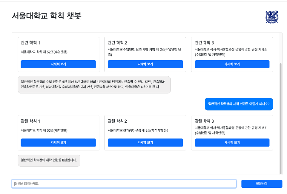
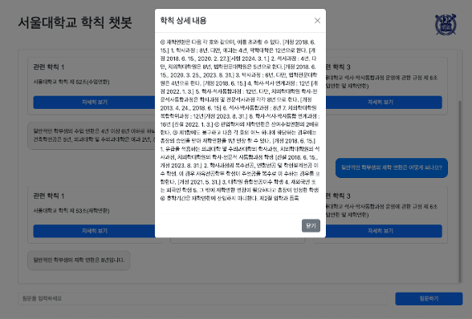

# SNU RAG Chatbot
RAG based chatbot to deal with school rules related questions of Seoul National University.

Done as a part of Creative Integrated Design2 Class.

## UI and Demo


 

<video width="736" height="461" controls>
  <source src="./assets/demo_video.mp4" type="video/mp4">
</video>

## How to use
1. Install dependencies
```
pip install -r requirements.txt
```

2. Install Milvus standalone based on your environment. Details are given [here](https://milvus.io/docs/v2.0.x/install_standalone-docker.md).

3. Prepare the database
```
cd snu_milvus

python init_db.py -n “snu_milvus_final”
python insert_embedding.py -n “snu_milvus_final” -I “output_final.csv” -b “4” -d “cuda”
```

4. Move and run `llm_inference.ipynb` in your own colab environment

5. Run the backend
    - You must set replace `COLAB_URI` of `rag_backend/rag/views.py` based on the `ngrok` url that you received from the `llm_inference.ipynb`
```
cd rag_backend

python manage.py runserver
```

6. Run the frontend
```
cd rag_frontend

npm install
npm start
```